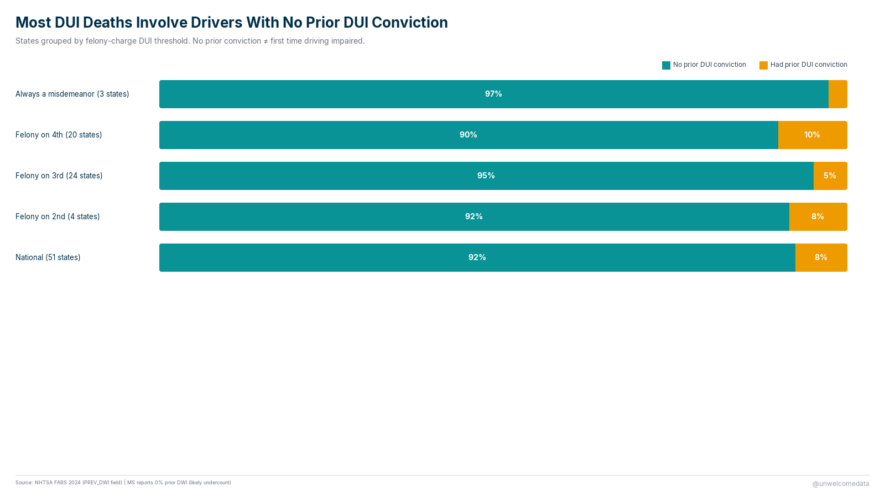
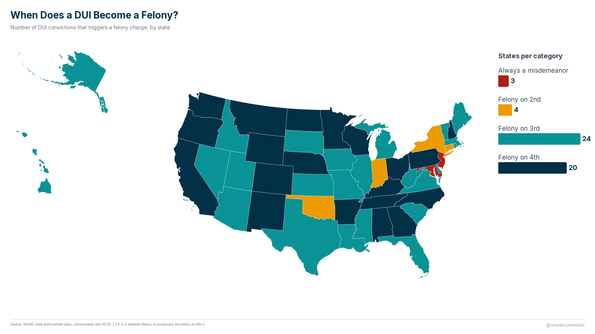
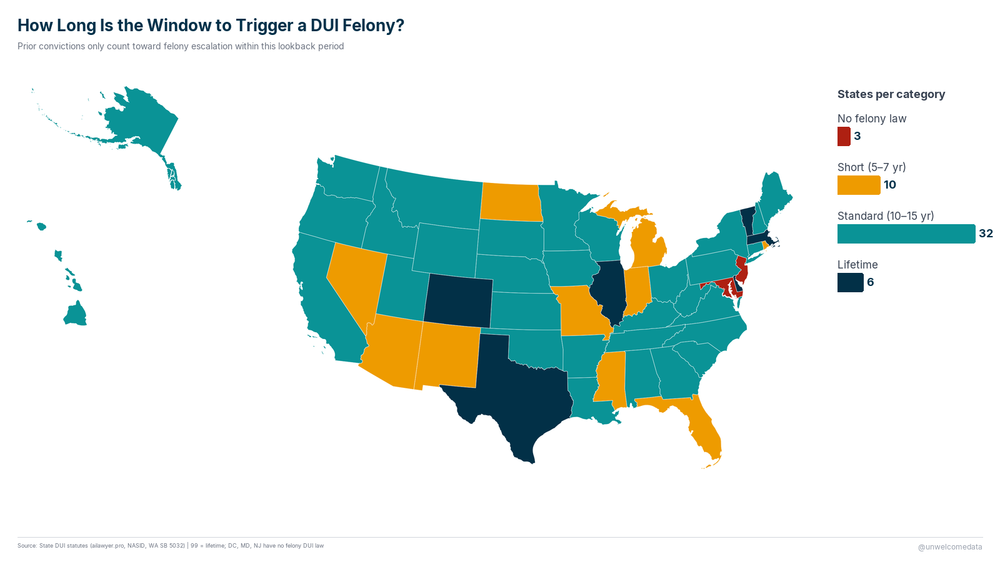
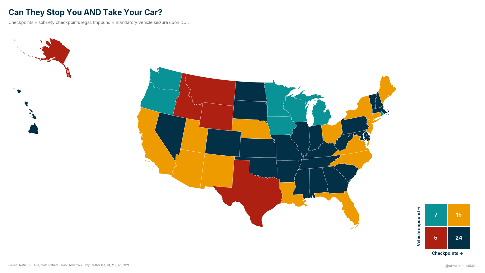

**[@unwelcomedata](https://unwelcomedata.github.io/dui-by-state/)** · data from public sources

# DUI by state: what the laws are, and what the deaths say

A 51-state comparison (50 states + DC) of drunk-driving **laws, penalties, and
enforcement mechanisms** set against the **fatality outcomes** those states
actually record — built entirely from official U.S. government sources.

**The finding that stuck:** in 2024, the large majority of people killed in
alcohol-impaired crashes were killed by drivers with **no prior DUI conviction**.
The intuition that drunk-driving deaths are mostly caused by repeat offenders who
slipped through the cracks isn't what the federal crash data shows — most of the
deaths trace to first-time offenders. And harsher penalty structures (felony
thresholds, lookback windows, mandatory devices) don't track with lower fatality
rates once you account for how rural and how driven a state is.

---

## The charts

**Most DUI deaths involve drivers with no prior DUI conviction.** First-time vs
repeat offenders among drivers in fatal alcohol-impaired crashes.



**When does a DUI become a felony?** The blood-alcohol level or repeat count at
which a state can charge a DUI as a felony varies widely.



**How long is the window to trigger a felony?** The "lookback period" — how many
years back a state counts prior offenses toward a felony charge.



**Can they stop you AND take your car?** Two enforcement powers combined —
sobriety checkpoints and vehicle impound/forfeiture — mapped together.



---

## How it was measured

The dataset pairs two very different kinds of column:

- **Laws and penalties** — coded from state statutes and the National Conference
  of State Legislatures: felony thresholds, lookback periods, ignition-interlock
  mandates, checkpoint authority, vehicle impound/forfeiture.
- **Fatality outcomes** — from NHTSA's Fatality Analysis Reporting System (FARS),
  the federal census of fatal traffic crashes.

**A measurement caveat worth stating plainly.** "No prior DUI conviction" in the
crash data means the driver had never been *convicted* — not that they had never
driven impaired before. It measures the justice system's record, not the driver's
full history. So the finding is precise as stated ("most fatal-crash drivers had
no prior conviction") and should not be overread as "these people never drove
drunk before."

**Two fatality definitions, kept separate.** FARS raw coding and NHTSA's
statistically *imputed* alcohol-involvement estimate (BAC ≥ 0.08) don't agree —
imputation raises the count. The dataset carries both columns rather than
blending them, and the codebook says which is which. NHTSA's imputed figure is
the one the agency treats as authoritative for alcohol-impaired fatality rates.

**On penalty severity.** States with harsher felony rules tend to show *higher*,
not lower, fatality rates — but that's confounded by rurality and region (rural,
high-mileage states both drive more and legislate harder). This dataset is built
for that kind of honest comparison, not to prove penalties cause outcomes.

Per-source collection methods, definitions, and known series breaks are in
[SOURCES.md](SOURCES.md).

---

## The data

The published dataset is in [`export/`](export/):

- `dui_by_state_v4.csv` — 51 rows (50 states + DC) × 48 columns: fatality
  outcomes, felony structure, enforcement mechanisms, penalties, and structural
  controls.
- `dui_by_state_v4_codebook.md` — a plain-English description of every column.

The richer packaging (Excel, Parquet) and the full pipeline code are in the repo.

---

## Reproduce it

This one rebuilds from a script, with one manual step. The FARS source files are
large government downloads, and one Census reference table is behind a
download-protected page, so those inputs are placed in `data/raw/` by hand (see
[SOURCES.md](SOURCES.md) for exact files and URLs). Once `data/raw/` is
populated, the pipeline runs end to end:

```bash
python scripts/ingest_all.py                 # base tables → DuckDB
python scripts/scrape_nasid.py               # enforcement scrape (Playwright)
python scripts/clean_enforcement.py          # standardize enforcement text
python scripts/compute_bac_testing_rates.py  # BAC testing from FARS person file
python scripts/prepare_export_v4.py          # join → export/ + codebook
```

Full run order and per-script notes are in [`scripts/README.md`](scripts/README.md).

---

## Sources & license

Full attribution — publisher, URL, collection method, definitions, series breaks,
and known controversies — is in [SOURCES.md](SOURCES.md). In short: NHTSA FARS
(fatal crashes), U.S. Census Bureau (population, geography), and NCSL + state
statutes (laws and penalties). All are U.S. government or public sources; no
crowd-edited sources are used. The compiled dataset is released by the author.

---

## Further exploration

Open avenues left on the table:

- No-refusal jurisdictions (states that let police obtain a warrant for a blood
  draw on the spot) vs. fatality rates.
- BAC-testing rates over time — are states testing killed drivers more often?
- A "better/worse than expected" view that adjusts fatality rates for rurality
  and vehicle-miles-traveled before ranking states.

---

> **AI-Assisted Development**
> This project was built with the assistance of [Kiro](https://kiro.dev), an
> AI-powered development environment. All data-sourcing decisions, methodology
> choices, and published findings are the responsibility of the author. AI was
> used for code generation, data-pipeline construction, and research assistance —
> not for analysis conclusions or editorial judgment.
